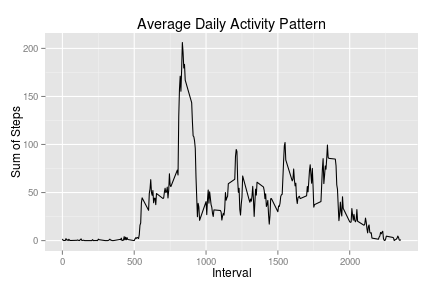

## Purpose
This project analyzes a persons activity that was captured using a pedometer.  The pedometer recorded the following information.

* steps: Number of steps taking in a 5-minute interval (missing values are coded as NA)

* date: The date on which the measurement was taken in YYYY-MM-DD format

* interval: Identifier for the 5-minute interval in which measurement was taken

Material and project instructions were provided by Roger D. Peng and team who are instructors for Reproducible Research.


## Loading and preprocessing the data

```r
download.file("http://d396qusza40orc.cloudfront.net/repdata%2Fdata%2Factivity.zip", "tempactivity.zip"
              ,mode="wb")
unzip("tempactivity.zip")
activity <- read.csv("activity.csv")

summary(activity)
```

```
##      steps                date          interval     
##  Min.   :  0.00   2012-10-01:  288   Min.   :   0.0  
##  1st Qu.:  0.00   2012-10-02:  288   1st Qu.: 588.8  
##  Median :  0.00   2012-10-03:  288   Median :1177.5  
##  Mean   : 37.38   2012-10-04:  288   Mean   :1177.5  
##  3rd Qu.: 12.00   2012-10-05:  288   3rd Qu.:1766.2  
##  Max.   :806.00   2012-10-06:  288   Max.   :2355.0  
##  NA's   :2304     (Other)   :15840
```

## What is mean total number of steps taken per day?

1. Calculate the total number of steps taken per day
2. Make a histogram of the total number of steps taken each day


```r
library(plyr)
activityByDay <- ddply(activity, .(date), summarise, steps = sum(steps, na.rm=T))
hist(activityByDay$steps, breaks=100, main = paste("Steps Per Day"), col="yellow", xlab="Sum of Steps")
```

 

3. Calculate and report the mean and median of the total number of steps taken per day  

+ Mean of the total number of steps taken per day:  

```r
mean(activityByDay$steps, na.rm = T)
```

```
## [1] 9354.23
```

+ Meadian of the total number of steps taken per day:  

```r
median(activityByDay$steps, na.rm = T)
```

```
## [1] 10395
```

##What is the average daily activity pattern?
1. Make a time series plot (i.e. type = "l") of the 5-minute interval (x-axis) and the average number of steps taken, averaged across all days (y-axis)  


```r
library(ggplot2)
activityByInterval <- ddply(activity, .(interval), summarise, steps = mean(steps, na.rm=T))
ggplot(activityByInterval, aes(interval, steps)) + geom_line() +
  ggtitle("Average Daily Activity Pattern") + xlab("Interval") + ylab("Sum of Steps")
```

 

2. Which 5-minute interval, on average across all the days in the dataset, contains the maximum number of steps?


```r
index <- which.max(activityByInterval$steps)
activityByInterval[index,]
```

```
##     interval    steps
## 104      835 206.1698
```


##Imputing missing values
Note that there are a number of days/intervals where there are missing values (coded as NA). The presence of missing days may introduce bias into some calculations or summaries of the data.

1. Calculate and report the total number of missing values in the dataset (i.e. the total number of rows with NAs)


```r
sum(is.na(activity$steps))
```

```
## [1] 2304
```

2. Devise a strategy for filling in all of the missing values in the dataset. The strategy does not need to be sophisticated. For example, you could use the mean/median for that day, or the mean for that 5-minute interval, etc.
3. Create a new dataset that is equal to the original dataset but with the missing data filled in.


```r
MeanSteps <- mean(activity$steps, na.rm=T)
activityImputed <- activity
activityImputed[is.na(activityImputed)]<-MeanSteps
head(activityImputed)
```

```
##     steps       date interval
## 1 37.3826 2012-10-01        0
## 2 37.3826 2012-10-01        5
## 3 37.3826 2012-10-01       10
## 4 37.3826 2012-10-01       15
## 5 37.3826 2012-10-01       20
## 6 37.3826 2012-10-01       25
```


4. Make a histogram of the total number of steps taken each day and Calculate and report the mean and median total number of steps taken per day. Do these values differ from the estimates from the first part of the assignment? What is the impact of imputing missing data on the estimates of the total daily number of steps?


```r
library(plyr)
activityImputedByDay <- ddply(activityImputed, .(date), summarise, steps = sum(steps, na.rm=T))
hist(activityImputedByDay$steps, breaks=100, main = paste("Steps Per Day"), col="yellow", xlab="Sum of Steps")
```

 

+ Mean of the total number of steps taken per day:  

```r
mean(activityImputedByDay$steps)
```

```
## [1] 10766.19
```

+ Meadian of the total number of steps taken per day:  

```r
median(activityImputedByDay$steps)
```

```
## [1] 10766.19
```

By substituting the mean steps for missing values, the mean and median converged from what we saw in the earlier estimtates.  The average number of steps also increased overall.

##Are there differences in activity patterns between weekdays and weekends?

For this part the weekdays() function may be of some help here. Use the dataset with the filled-in missing values for this part.

1. Create a new factor variable in the dataset with two levels – “weekday” and “weekend” indicating whether a given date is a weekday or weekend day.


```r
activityImputed$day <- weekdays(as.Date(activityImputed$date))
activityImputed = within(activityImputed, {
    dayType = ifelse(day %in% c("Saturday","Sunday"), "Weekend","Weekday")
})
```

2. Make a panel plot containing a time series plot (i.e. type = "l") of the 5-minute interval (x-axis) and the average number of steps taken, averaged across all weekday days or weekend days (y-axis). See the README file in the GitHub repository to see an example of what this plot should look like using simulated data.


```r
activityImputedByDayType <- aggregate(steps ~ interval + dayType, activityImputed, mean)

ggplot(activityImputedByDayType, aes(interval, steps)) + geom_line() + facet_grid(dayType ~ .) +
  ggtitle("Average Daily Activity Pattern") + xlab("Interval") + ylab("Sum of Steps")
```

 

The analysis shows that activity remains more consistent on the weekend where as there is an increased period of activity at the beginning of the day during weekdays which then decreases to lower levels as the day goes on.
